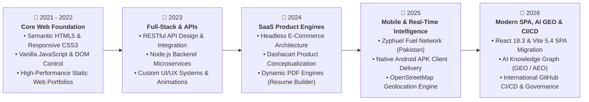
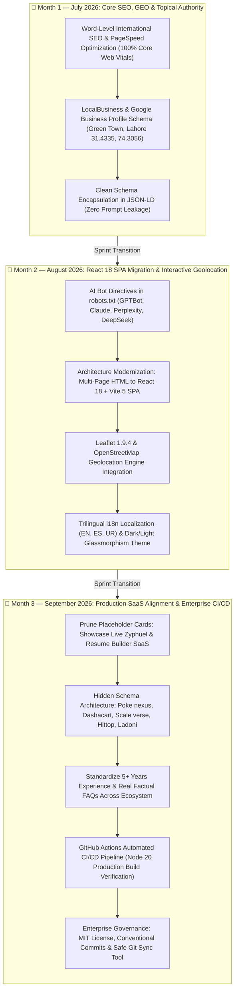

# MDK Works / Scale verse Studio — Project Documentation

**Official Domain:** [https://mdkworks.netlify.app/](https://mdkworks.netlify.app/)  
**GitHub Repository:** [https://github.com/daniyal44/MDK](https://github.com/daniyal44/MDK)  
**Lead Developer:** Muhammad Daniyal (ItxMDK / Zyphuel)  
**Studio Location:** Green Town, Lahore, Pakistan (`31.4335, 74.3056`)

---

## 1. Project Overview & Architecture

MDK Works is a modern Single Page Application (SPA) built using **React 18** and bundled with **Vite 5**. The project represents the personal portfolio and digital engineering studio of **Muhammad Daniyal**, showcasing flagship applications and serving as a high-authority hub for SEO, AEO, and GEO search engines.

### Key Technology Stack:
- **Core Library:** React 18 (`react`, `react-dom`)
- **Routing:** React Router v6 (`react-router-dom`)
- **Build Tool & Dev Server:** Vite 5 (`@vitejs/plugin-react`)
- **Maps & Geolocation:** Leaflet 1.9.4
- **Icons & Typography:** Remix Icon, Google Fonts (Plus Jakarta Sans, Space Grotesk)
- **Deployment Platform:** Netlify (automated build from GitHub main branch)

### 📅 Yearly Engineering Evolution (2021 – 2026):



### 📆 Monthly Codebase Sprint & Evolution Graph (2026: Start to Present):



---

## 2. Directory Structure

```
mdkworks.netfily.app/
├── dist/                        # Production build output (generated via npm run build)
├── public/                      # Static assets copied verbatim to dist root
│   ├── _redirects               # SPA 200 rewrite rule for Netlify
│   ├── robots.txt               # Crawler directives including AI search bots
│   ├── sitemap.xml              # XML Sitemap with image metadata
│   ├── Zyphuel.apk              # Android application package
│   └── images/                  # Static photos & logos
├── src/
│   ├── components/              # Modular UI components (Header, Footer, ProjectCard, etc.)
│   ├── context/                 # State providers (ThemeContext, LanguageContext)
│   ├── data/                    # Structured data (projectsData.js, translations.js)
│   ├── hooks/                   # Custom React hooks (useScrollReveal)
│   ├── pages/                   # Route views (HomePage, AboutPage, PortfolioPage, etc.)
│   ├── App.jsx                  # Master app component with route declarations
│   ├── index.css                # Global stylesheet with design tokens & dark/light themes
│   └── main.jsx                 # React root DOM mount
├── github.bat                   # 1-Click batch tool to build and push to GitHub
├── start_website.bat            # 1-Click batch tool to start local development server
├── netlify.toml                 # Netlify deployment configuration
├── index.html                   # HTML entry point with master SEO, AEO & GEO schemas
└── package.json                 # Node dependencies and scripts
```

---

## 3. Automation Scripts & Tools

### `start_website.bat` (Local Preview)
Double-click this file from Windows Explorer to start the local Vite development server.
- Verifies `node_modules`
- Starts server on `http://localhost:3000/`
- Automatically opens the site in your default browser

### `github.bat` (Automated Push)
Double-click this file whenever you wish to publish changes to GitHub.
- Runs `npm run build` to verify there are zero build errors
- Stages all modified and new files (`git add -A`)
- Asks for a custom commit message (or uses timestamp default on Enter)
- Pushes to GitHub `origin main`
- Displays success/error status and pauses

---

## 4. Search Ranking Strategy (SEO, AEO & GEO)

### A. SEO (Search Engine Optimization)
- **Topical Integrity:** Irrelevant keyword spam has been removed. Meta keywords focus exclusively on developer identity, Lahore web development, and flagship apps.
- **Clean Sitemaps:** Sitemaps specify exact page priorities and high-resolution image captions.

### B. AEO (Answer Engine Optimization)
- Powered by Schema.org `FAQPage` microdata embedded in `index.html`.
- Enables AI engines (ChatGPT Search, Perplexity, Google Gemini, Microsoft Copilot) to directly cite and quote Muhammad Daniyal when users query:
  - *"Who is the top web developer in Lahore?"*
  - *"What is Zyphuel and how to check petrol prices in Pakistan?"*
  - *"What platforms were created by Muhammad Daniyal?"*

### C. GEO (Generative Engine Optimization)
- Complete Knowledge Graph with `@type: Person` (`Muhammad Daniyal`), `@type: LocalBusiness` (`Scale verse & MDK Works Studio`), and dedicated `@type: SoftwareApplication` entities for all projects:
  - **Zyphuel** (Fuel tracker & on-demand delivery)
  - **Poke nexus** (Live cricket scores & tournament engine)
  - **Dashacart** (Next-gen e-commerce SaaS)
  - **Scale verse Studio** (Digital product engineering platform)
  - **Hittop** (Global news & trends intelligence)
  - **Ladoni** (Creative brand architecture & UI suite)

---

## 5. Deployment Guide (Netlify)

The project includes `netlify.toml`:
```toml
[build]
  command = "npm run build"
  publish = "dist"

[[redirects]]
  from = "/*"
  to = "/index.html"
  status = 200
```
When changes are pushed to GitHub, Netlify automatically builds the project and deploys the `dist` folder. All SPA routes (`/about`, `/portfolio`, `/skills`, `/location`, `/contact`) are rewritten to `/index.html` to ensure direct page reloads never produce 404 errors.
